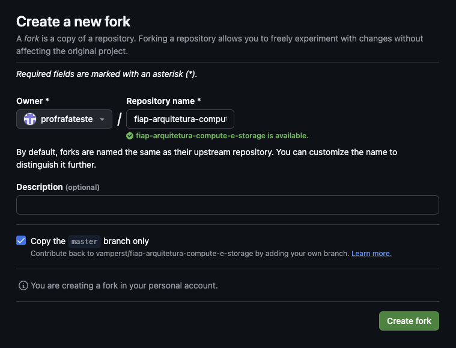
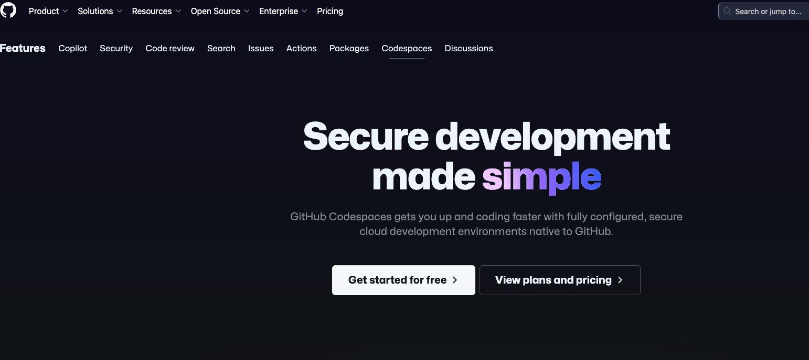
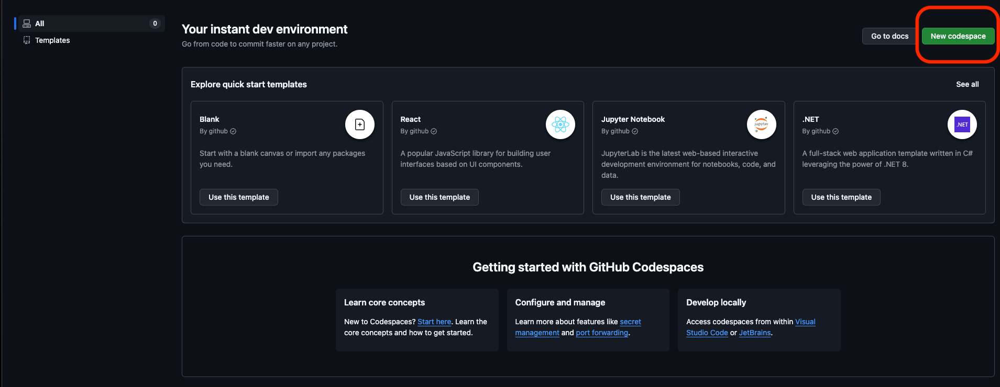
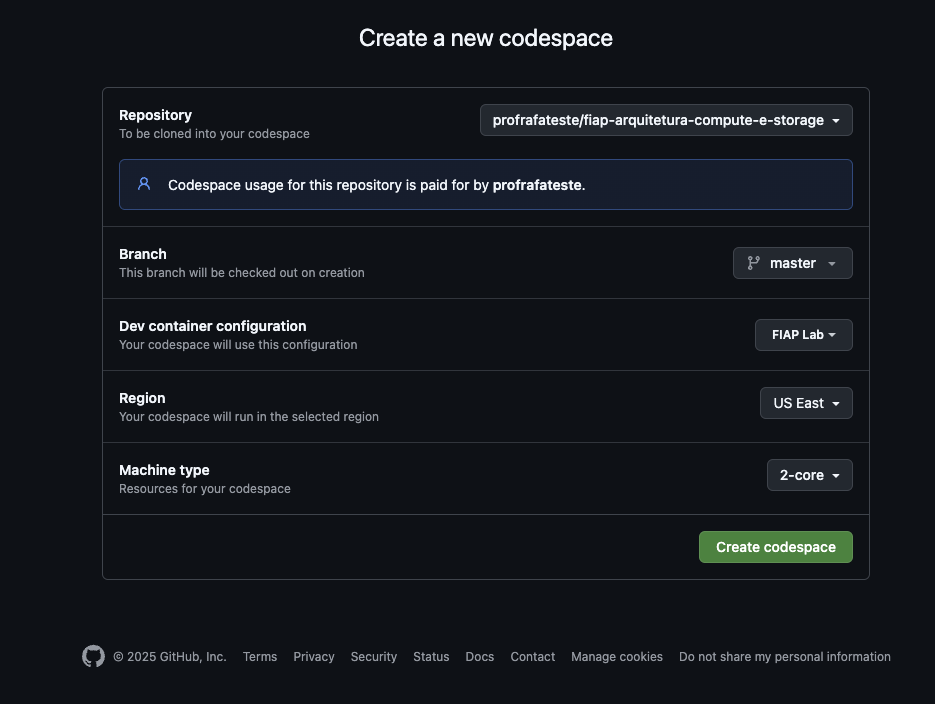
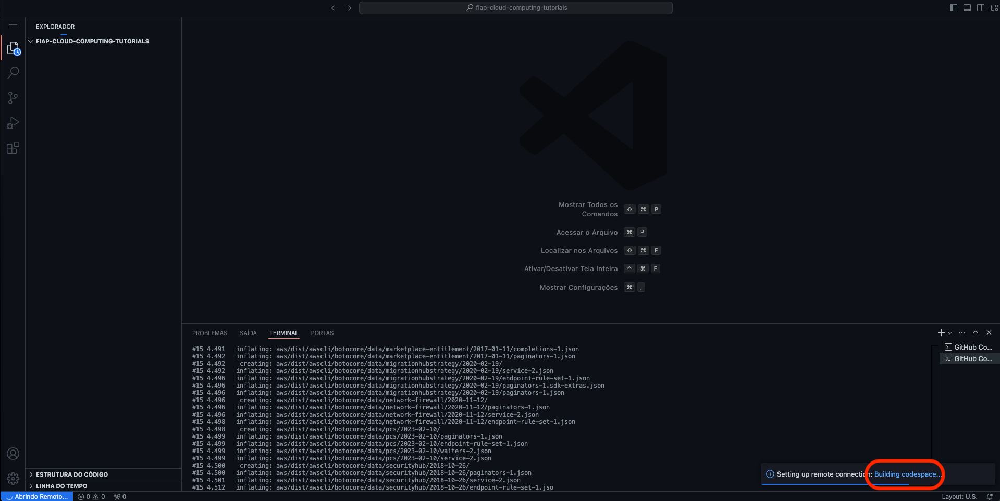
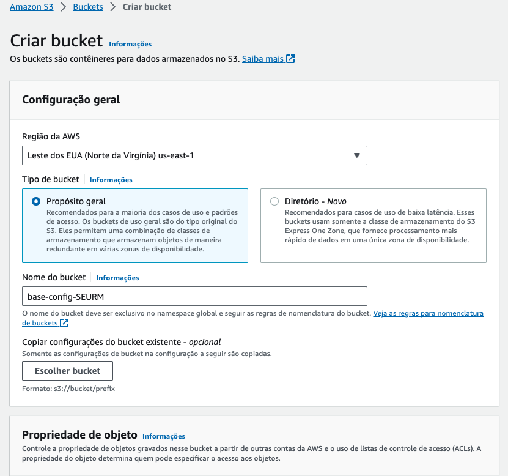
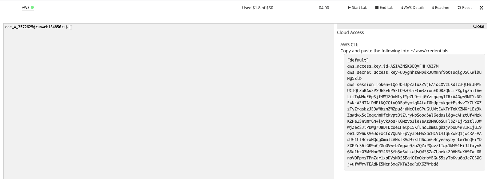
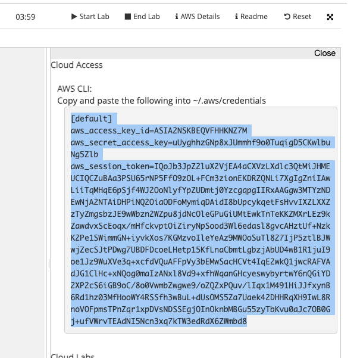
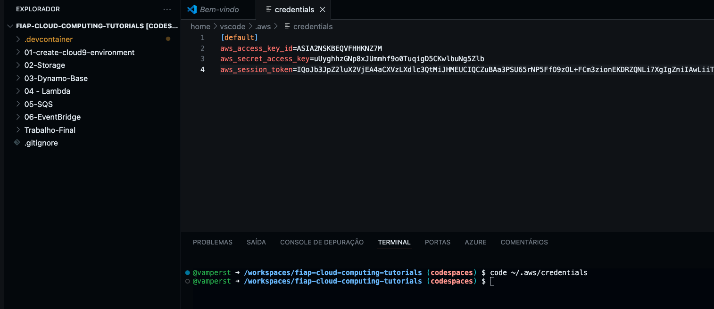
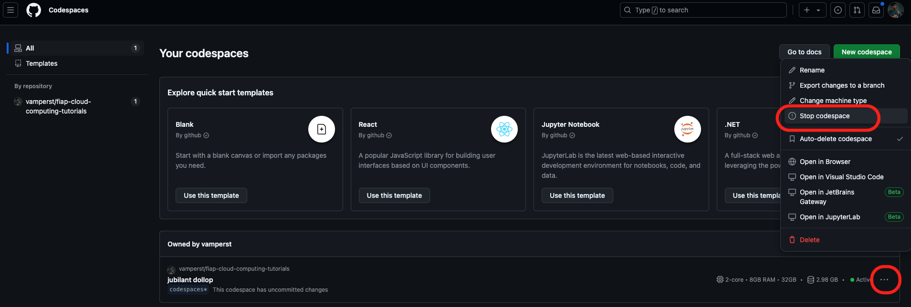

# 01 - Setup e Configuração de ambiente

Você irá utilizar 2 ferramentas para desenvolver os laboratorios:

1. Conta AWS através da AWS Academy. Conta provisionada para você utilizar durante essa disciplina com 50 dólares de crédito.
2. [Github Codespaces](https://github.com/features/codespaces). Uma IDE cloud online para todos terem um ambeinte igual e com a autorização para executar os comandos dos exercicios.

### Github Codespaces
1. Vamos utilizar sua conta do github para acessar o Codespaces. Caso não tenha uma conta, crie uma em [github.com](github.com).
2. Primeiro vamos fazer o fork do repositório que contém os exercícios da disciplina. Acesse o link [fiap-arquitetura-compute-e-storage](https://github.com/vamperst/fiap-arquitetura-compute-e-storage)
3. No canto superior da tela haverá o botão `Forkear` para você copiar o repositório para sua conta do github. Clique nele para copiar o repositório para sua conta.

4. Após clicar no botão, você será redirecionado para a tela de fork do repositório. Deixe a opção `Copy the master branch only` desmarcada como no print para que copie todas as branches do repositório. Clique em `Create Fork` para copiar o repositório para sua conta.

5. Agora vamos criar de fato o Codespaces. Acesse o link [Github Codespaces](https://github.com/features/codespaces) e clique em `Get Started for free`.

6. Clique em `New codespace` nmo canto superior direito para criar um novo ambiente.

7. Deixe as opções da tela da seguinte forma e clique em `Create Codespace`:
   1. repository: `fiap-arquitetura-compute-e-storage`
   2. Branch: `master`
   3. Dev container configuration: `FIAP Lab`
   4. Region: `US East`
   5. Machine type: `2-core`

8. Após a criação do ambiente, você será redirecionado para o ambiente do Codespaces. No canto inferior esquerdo da tela, clique em `Building codespace` na lateral inferior direita para abrir os logs de criação do Codespace.
    

9.  Essa criação pode demorar até 15 minutos com tudo necessário já instalado. Após a criação, você verá a tela do Codespaces com o repositório clonado e pronto para ser utilizado. <b>Deixe a aba aberta enquanto executa os próximos passos.</b>

### Conta AWS - Academy

1. Caso não tenha conta no AWS Academy ainda:
   1. Entre no seu email da FIAP pelo endereço [webmail.fiap.com.br](http://webmail.fiap.com.br/)
   2. Seu email é no seguinte formato rm + numero do seu RM + @fiap.com.br. Caso seu RM seja por exemplo 12345 seu email seria <rm12345@fiap.com.br>. A senha é a mesma de portais.
   3. Você terá um email na caixa de entrada para convite do Academy, siga as instruções.
   4. Ao conseguir entrar na plataforma do academy, aparecerá uma turma que começa com `AWS Academy Learner Lab`. Apenas clique em `Enroll` para aceitar e acessar.
2. Para entrar na conta do Academy que já existe, acesse o link:  [awsacademy.com/LMS_Login](https://www.awsacademy.com/LMS_Login). Ao conseguir entrar na plataforma do academy, aparecerá uma turma que começa com AWS Academy Learner Lab. Apenas clique em Enroll para aceitar e acessar.
3. Dentro da plataforma clique em `cursos` na lateral esquerda e clique no curso da disciplina atual.

4. Dentro do curso clique em `Módulos` na lateral esquerda

   

5. Clique em `Iniciar os laboratórios de aprendizagem da AWS Academy`

   

6. Se for seu primeiro acesso irão aparecer os 2 contratos de termos e condições para aceitar. Role até o final para aceitar após a leitura do mesmo. Caso já tenha feito isso antes. Pule para o passo 8.
   
7. Clique no link iniciando com `Academy-CUR` para acessar a conta AWS.Caso peça consentimento clique em `I agree` e execute o passo novamente.
   
8. Essa é a tela para acessar sua conta AWS. Cada sessão terá 4 horas. Após esse tempo você terá que começar outra sessão, mas os dados gravados dentro da conta AWS ficam salvos até o final do curso ou entrega do trabalho final da disciplina. Clique em `Start Lab` para iniciar uma sessão. Esse processo pode demorar alguns minutos.
   
   
9. Quando tudo estiver pronto a bolinha ao lado do escrito `AWS` no superior esquerdo da tela ficará verde como na imagem abaixo. Apenas clique em `AWS` para abrir a conta aws em outra aba do navegador.

### AWS

1.  Agora vamos criar o Bucket S3 que irá receber todos os arquivos de configuração durante o curso. Para tal, abra uma aba do console AWS no [serviço S3](https://us-east-1.console.aws.amazon.com/s3/home?region=us-east-1#).
2.  Clique em 'Criar bucket'
    
3.  De o nome do bucket de `base-config-<SEU RM>` e clique em `Criar`.
    

### Voltando ao codespaces

1.  Volte para a aba do Codespaces que você criou anteriormente.
2.  Verifique se o terminal do codespaces está aberto. Caso não esteja, clique em `Terminal` na parte inferior da tela.
3.  Agora você vai copiar as permissões da aws para dentro do codespaces. Para abrir o arquivo de configuração da aws, digite o comando `code ~/.aws/credentials` no terminal e pressione `Enter`.
4.  Por enquanto o arquivo estará vazio. Na outra aba do AWS Academy onde acessa a conta da AWS e no canto superior direito clique em 'AWS Details' e clique em 'show' nos campos de AWS CLI.

5.  Copie o conteudo da credencial para a area de transferência(Ctrl+C).
    

6. Volte para o Codespaces e cole o conteudo copiado no arquivo `~/.aws/credentials` e salve o arquivo com ctrl+s.

7. Para testar execute o comando `aws s3 ls` no terminal do codespaces. Se tudo estiver correto, você verá a lista de buckets do S3 que acabou de criar.
   

8. Pronto! Seu ambiente está configurado e pronto para começar os laboratórios. 

> [!WARNING] 
> Esse passo de copiar as credenciais para o Codespaces é necessário para que você consiga executar os comandos da AWS. Caso você feche o Codespaces e abra novamente, você terá que repetir esse passo para copiar as credenciais novamente. Assim como no inicio de cada aula.

>[!CAUTION]
> <b>SEMPRE DESLIGUE</b> o ambiente ao final de cada aula para não gerar custos extras ou acabar com suas horas gratis no Codespaces. Para desligar acesse o [link](https://github.com/codespaces) clique no 3 pontinhos ao lado do ambiente e clique em `Stop Codespace`.

