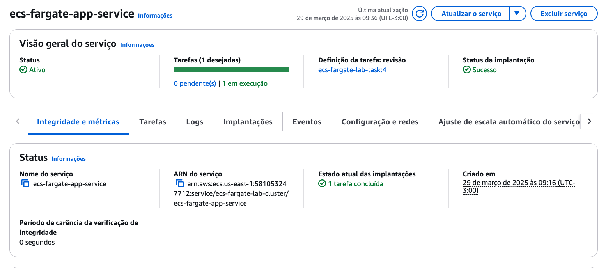

# 03.2 - Lab ECS + Fargate


## Parte 1 - Monte o ambiente

1. No codespaces execute o comando abaixo para entrar na pasta correta do terraform que vai provisionar o lab:

```bash
cd /workspaces/fiap-arquitetura-compute-e-storage/03-Compute/02-ECS-Fargate/terraform
```

2. Execute o comando abaixo para copiar o nome do bucket que será utilizado para armazenar o estado do terraform:

```bash
export bucket=$(aws s3 ls | awk '/base-config-/ {print $3; exit}')
sed -i "s/base-config-SEU_RM/$bucket/g" state.tf
```
3. Execute o comando abaixo para inicializar o terraform:

```bash
terraform init
```

4. Execute o comando abaixo para aplicar o plano do terraform:

```bash
terraform plan -out out.plan
terraform apply out.plan
```

## Parte 2 - Subir o código da aplicação para o ECR

5. Chegou a hora de montar a aplicação e primeiro entre na pasta onde esta o código. Execute os comandos abaixo:

```bash
cd /workspaces/fiap-arquitetura-compute-e-storage/03-Compute/02-ECS-Fargate/app
```
6. Execute o comando abaixo para fazer o login no ECR:

```bash
ECR_REPO_URL=$(aws ecr describe-repositories --repository-name ecs-fargate-lab | jq .repositories[0].repositoryUri -r)
aws ecr get-login-password | docker login --username AWS --password-stdin $ECR_REPO_URL
```


7. Execute o comando abaixo para construir a imagem da aplicação:

```bash
docker build -t ecs-fargate-lab .
```


8. Execute o comando abaixo para taggear a imagem:

```bash
docker tag ecs-fargate-lab:latest $ECR_REPO_URL:latest
```

9. Execute o comando abaixo para enviar a imagem para o ECR:

```bash
docker push $ECR_REPO_URL:latest
```


11. Vá até o console do [ECR](https://us-east-1.console.aws.amazon.com/ecr/private-registry/repositories?region=us-east-1) e verifique se a imagem foi enviada com sucesso. Clique no repositório `ecs-fargate-lab` e verifique se a imagem foi enviada.


12.  Agora vamos até o ECS verificar se a task foi criada. Acesse o console do [ECS](https://us-east-1.console.aws.amazon.com/ecs/home?region=us-east-1#/clusters) e clique no cluster `ecs-fargate-lab-cluster`.


13. Na aba `Serviços` você consegue verificar se a tarea foi criada. Clique no serviço `ecs-fargate-lab-service` e verifique se a task foi criada.




14. Para testar se esta tudo correto, você precisa do IP do fargate rodando. Para isso siga os passos abaixo:
    1.  Clique na aba `Tarefas`
     

    2. Clique na tarefa em execução
     
    3. Dentro da tarefa clique em `Associações de rede`
     
    4. Clique em `endereço aberto` para abrir uma nova aba com o IP do fargate
     
    5. Caso de certo você verá a tela abaixo
     
    6. Caso esteja conectado a rede da FIAP e não consiga acessar a porta 3000 via naveegador, copie o IP e utilize o terminal do codespaces para testar o acesso com o comando abaixo:
    ```bash
    curl http://IP_DO_FARGATE:3000
    ```
     

15. 